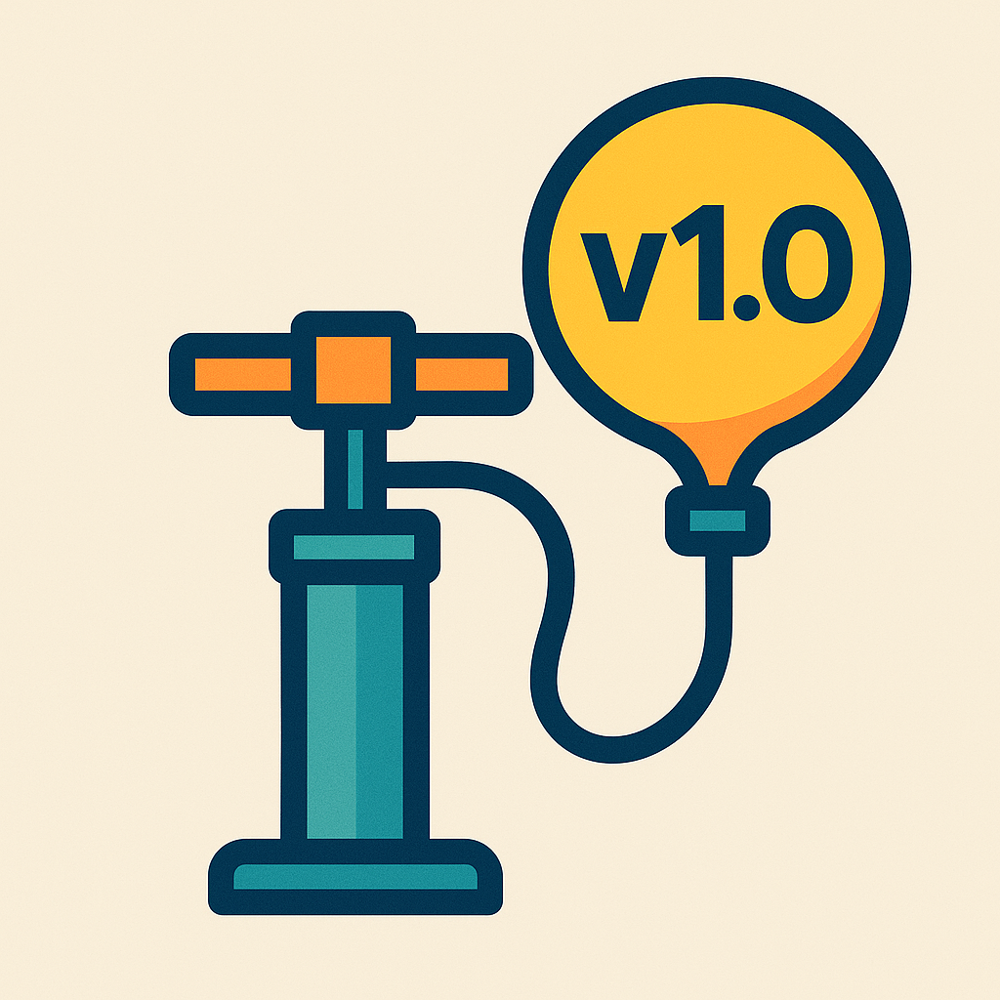

# 🚀 Pumper


<<<<<<< Updated upstream
=======
[](https://github.com/tatus9/pumper/actions/workflows/ci.yml)
[](https://badge.fury.io/py/pumper)
[](https://pypi.org/project/pumper/)
[](https://github.com/tatus9/pumper/blob/main/LICENSE)
[](https://pypi.org/project/pumper/)

A tool that care about versions, you could you manually or it could be used as a pre-commit hook to automate version bumping and changelog management using conventional commits.
>>>>>>> Stashed changes

Automated version bumping and changelog management using conventional commits.

## Features

- 🔄 Automatic version bumping based on conventional commits
- 📝 Automated changelog generation
- 🎣 Git pre-commit hook integration
- ⚡ CLI tool for manual version management
- 🏷️ Pre-release version support (alpha, beta, rc)
- 🔗 Automatic version comparison links in changelog

## Installation

Install from PyPI:

Install from PyPI:

```bash
pip install pumper
```

<<<<<<< Updated upstream
### Git Hook Setup

To automatically bump versions on commit:
=======
Or install the latest development version:

```bash
pip install git+https://github.com/tatus9/pumper.git
```

### Setup Git Hook

Add to your `.pre-commit-config.yaml`:

```yaml
repos:
  - repo: https://github.com/tatus9/pumper
    rev: v1.1.0  # Use the latest version
    hooks:
      - id: pumper
```

Install the hooks:
>>>>>>> Stashed changes

```bash
# Install pre-commit if not already installed
pip install pre-commit

# Add to .pre-commit-config.yaml:
repos:
  - repo: local
    hooks:
      - id: pumper
        name: pumper
        entry: pumper hook
        language: python
        stages: [commit-msg]


# Install the hook
pre-commit install --hook-type commit-msg
```

## Usage

### CLI

Bump version manually:

```bash
# Bump version based on conventional commits
pumper minor

# Dry run to see what would happen
pumper major --dry-run

# Bump with pre-release label
pumper minor --pre-release beta

# Use custom config file
pumper patch --config package.json

# Skip changelog update
pumper minor --skip-changelog
```

### Python API

```python
from pumper import Version, ConventionalCommit, ChangelogManager

# Parse and bump version
version = Version.parse("1.2.3")
new_version = version.bump("minor")
print(str(new_version))  # "1.3.0"

# Parse commit message
commit = ConventionalCommit.parse(
    "feat(api)!: add new endpoint\n\nBREAKING CHANGE: new auth"
)
print(commit.breaking)  # True

# Update changelog
config = ChangelogConfig(repo_url="https://github.com/tatus9/pumper.git")
manager = ChangelogManager(config)
manager.update_changelog(
    Path("CHANGELOG.md"),
    str(new_version),
    [commit]
)
```

### Conventional Commits

The tool follows the [Conventional Commits](https://www.conventionalcommits.org/) specification:

- `feat`: Minor version bump (feature)
- `fix`: Patch version bump (bug fix)
- `!` or `BREAKING CHANGE`: Major version bump
- Other types (no version bump):
  - `docs`: Documentation only
  - `style`: Code style changes
  - `refactor`: Code refactoring
  - `perf`: Performance improvements
  - `test`: Adding/updating tests
  - `chore`: Maintenance tasks

Special footer tokens:
- `[skip-bump]`: Skip version bump
- `[force-major]`: Force major bump
- `[force-minor]`: Force minor bump
- `[force-patch]`: Force patch bump
- `[pre-release=label]`: Add pre-release label

## Configuration

The tool looks for version strings in:
1. `pyproject.toml`
2. `package.json`
3. Custom file specified with `--config`

Version pattern: `version = "X.Y.Z"` or `"version": "X.Y.Z"`

## License

MIT License - feel free to use this project for any purpose.
